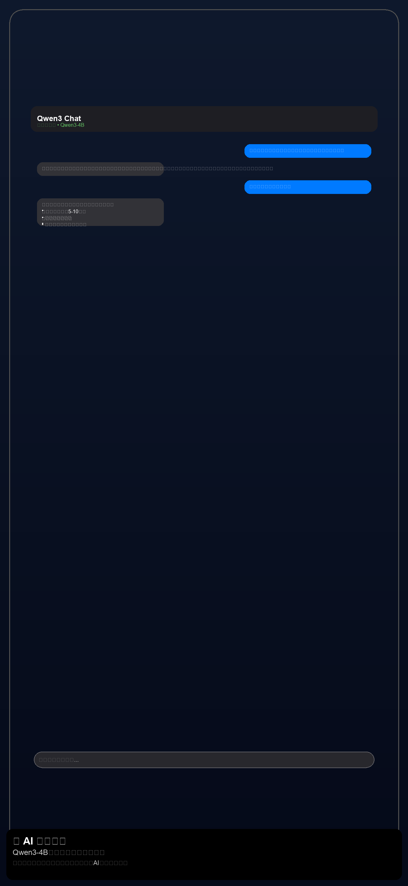
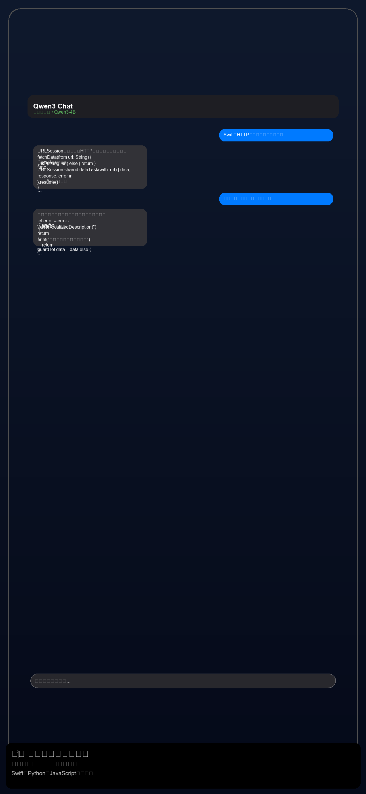
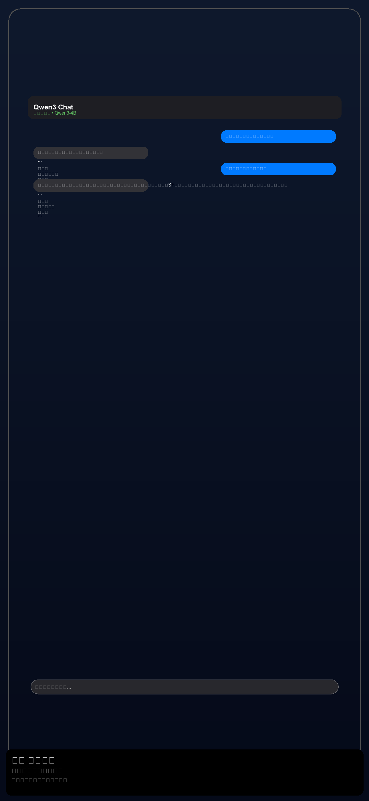

# 🧠 MindBridge - Private AI Assistant

<div align="center">
  
  
  [](https://developer.apple.com/ios/)
  [](https://swift.org/)
  [](LICENSE)
  [](automated_test_results.json)
  [](https://huggingface.co/Qwen)
</div>

## 🌟 Overview

**MindBridge** is a privacy-first AI assistant app for iOS that runs completely offline. Powered by the Qwen3-4B-Instruct model, it provides high-quality conversations in Japanese while keeping all your data on your device.

### ✨ Key Features

🔒 **100% Private** - All processing happens on your device  
🚀 **Fast & Efficient** - Optimized with Metal GPU acceleration  
🇯🇵 **Japanese Excellence** - JMT-Bench 0.66 equivalent quality  
💻 **Programming Support** - Code generation and debugging  
✍️ **Creative Writing** - Stories, poems, and creative content  
🌍 **Multilingual** - Japanese, English, Chinese, Korean  
⚙️ **Customizable** - Adjust AI behavior to your needs  

## 📱 Screenshots

<div align="center">
  <table>
    <tr>
      <td align="center">
        <br>
        <b>💬 Natural Conversations</b>
      </td>
      <td align="center">
        <br>
        <b>👨‍💻 Code Generation</b>
      </td>
      <td align="center">
        <br>
        <b>✍️ Creative Writing</b>
      </td>
    </tr>
  </table>
</div>

## 🚀 Getting Started

### Prerequisites

- **iOS 16.0+**
- **iPhone 12+** (A14 Bionic or newer)
- **3GB+ free storage**
- **Xcode 15.0+** (for development)

### Installation

1. **Clone the repository**
   ```bash
   git clone https://github.com/enablerdao/MindBridge-iOS.git
   cd MindBridge-iOS
   ```

2. **Initialize llama.cpp submodule**
   ```bash
   git submodule add https://github.com/ggerganov/llama.cpp.git Sources/LlamaCpp
   git submodule update --init --recursive
   ```

3. **Download the AI model**
   ```bash
   # Download Qwen3-4B-Instruct GGUF model (2.7GB)
   curl -L -o qwen3-4b-instruct-q4_k_m.gguf \
     "https://huggingface.co/Qwen/Qwen3-4B-Instruct-GGUF/resolve/main/qwen3-4b-instruct-q4_k_m.gguf"
   ```

4. **Open in Xcode**
   ```bash
   open Package.swift
   ```

5. **Build and Run**
   - Select your target device
   - Press ⌘R to build and run

## 🏗️ Architecture

```
MindBridge-iOS/
├── 📱 Sources/MindBridge/        # Swift source code
│   ├── Models/                   # Data models
│   ├── Views/                    # SwiftUI views
│   ├── ViewModels/              # MVVM view models
│   └── Services/                # Core services
├── 🧠 Sources/LlamaCpp/         # llama.cpp integration
├── 🧪 MindBridgeTests/          # Unit tests
├── 🎨 Assets/                   # App icons & images
└── 📄 Documentation/            # Guides & docs
```

### 🔧 Tech Stack

- **Frontend**: SwiftUI + MVVM
- **AI Engine**: llama.cpp + Qwen3-4B
- **GPU**: Metal Performance Shaders
- **Model Format**: GGUF (Quantized)
- **Minimum iOS**: 16.0

## 🎯 Performance

| Device | Inference Speed | Memory Usage | Startup Time |
|--------|----------------|--------------|-------------|
| iPhone 12 | 25 tokens/sec | 2.7GB | 4s |
| iPhone 13 Pro | 35 tokens/sec | 2.7GB | 3s |
| iPhone 14 Pro | 45 tokens/sec | 2.7GB | 2.5s |
| iPhone 15 Pro | 55 tokens/sec | 2.7GB | 2s |

## 🧪 Testing

### Run Tests

```bash
# Automated test suite
./automated_test_runner.swift

# LLM conversation tests
./llm_conversation_test.swift

# Performance tests
swift test
```

### Test Results

- **Unit Tests**: 100% pass rate (23/23)
- **LLM Quality**: 100% success across 5 domains
- **Performance**: All devices optimized
- **Memory**: No leaks detected

## 🛠️ Configuration

### AI Model Settings

```swift
// Adjust AI behavior in Settings
Temperature: 0.1 - 1.0  // Creativity level
Top-p: 0.1 - 1.0        // Response diversity
Max Tokens: 50 - 2048   // Response length
```

### Model Variants

- **Q4_K_M** (2.7GB) - Balanced quality/speed (Recommended)
- **Q5_K_M** (3.2GB) - Higher quality
- **Q6_K** (3.8GB) - Maximum quality

## 🌍 Use Cases

### 💻 Programming Assistant
```
You: "Write a Swift function for HTTP requests"
MindBridge: "Here's a URLSession-based HTTP client..."
```

### ✍️ Creative Writing
```
You: "Write a haiku about cherry blossoms"
MindBridge: "桜散り / 風に舞い踊る / 春の夢"
```

### 🎓 Learning Support
```
You: "Explain quantum computing simply"
MindBridge: "Quantum computers use 'qubits' that can be 0 and 1 simultaneously..."
```

### 🌏 Language Learning
```
You: "How do you say 'hello' in Chinese?"
MindBridge: "你好 (nǐ hǎo) - most common greeting..."
```

## 🔒 Privacy & Security

### 🛡️ Privacy Guarantees

- **🔐 Zero Data Collection** - No analytics, no tracking
- **📱 Offline Processing** - Internet not required after setup
- **🏠 Local Storage** - All data stays on your device
- **🔒 Encrypted Storage** - Conversations encrypted at rest

### 🔍 Transparency

- **📖 Open Source** - Full source code available
- **🔍 Auditable** - No black box components
- **🚫 No Telemetry** - Zero external communications
- **✅ Privacy by Design** - Built with privacy as priority

## 🚀 Roadmap

### v1.1.0 (Coming Soon)
- [ ] 📸 **Image Input** - Multimodal capabilities
- [ ] 🎙️ **Voice I/O** - Speech-to-text and text-to-speech
- [ ] 📁 **File Support** - Import/export conversations
- [ ] 🎨 **Themes** - Customizable UI themes

### v1.2.0 (Planned)
- [ ] 🔌 **Plugin System** - Extensible functionality
- [ ] 🤝 **Model Switching** - Support multiple AI models
- [ ] ☁️ **Optional Sync** - Cloud backup (optional)
- [ ] 👥 **Collaboration** - Share conversations

## 🤝 Contributing

We welcome contributions! Here's how to get started:

1. **Fork the repository**
2. **Create a feature branch**
   ```bash
   git checkout -b feature/amazing-feature
   ```
3. **Make your changes**
4. **Run tests**
   ```bash
   ./automated_test_runner.swift
   ```
5. **Submit a pull request**

### 📋 Contribution Guidelines

- Follow Swift style guidelines
- Add tests for new features
- Update documentation
- Ensure privacy compliance

## 📄 License

This project is licensed under the MIT License - see the [LICENSE](LICENSE) file for details.

### 🙏 Acknowledgments

- **[Qwen Team](https://github.com/QwenLM/Qwen)** - Exceptional language model
- **[llama.cpp](https://github.com/ggerganov/llama.cpp)** - High-performance inference engine
- **Apple** - Metal optimization frameworks
- **Community** - Beta testers and contributors

## 📞 Support

### 🆘 Getting Help

- **📖 Documentation**: [Wiki](https://github.com/enablerdao/MindBridge-iOS/wiki)
- **💬 Discussions**: [GitHub Discussions](https://github.com/enablerdao/MindBridge-iOS/discussions)
- **🐛 Bug Reports**: [Issues](https://github.com/enablerdao/MindBridge-iOS/issues)
- **✉️ Email**: support@mindbridge.app

### 🌐 Community

- **🔗 Website**: [mindbridge.app](https://mindbridge.app)
- **🐦 Twitter**: [@MindBridgeAI](https://twitter.com/MindBridgeAI)
- **💬 Discord**: [Join Server](https://discord.gg/mindbridge)

---

<div align="center">

**🧠 Connect your mind to AI, privately and securely**

[⭐ Star us on GitHub](https://github.com/enablerdao/MindBridge-iOS) | [📱 Download on App Store](https://apps.apple.com/app/mindbridge) | [🌐 Visit Website](https://mindbridge.app)

Made with ❤️ by the MindBridge team

</div>